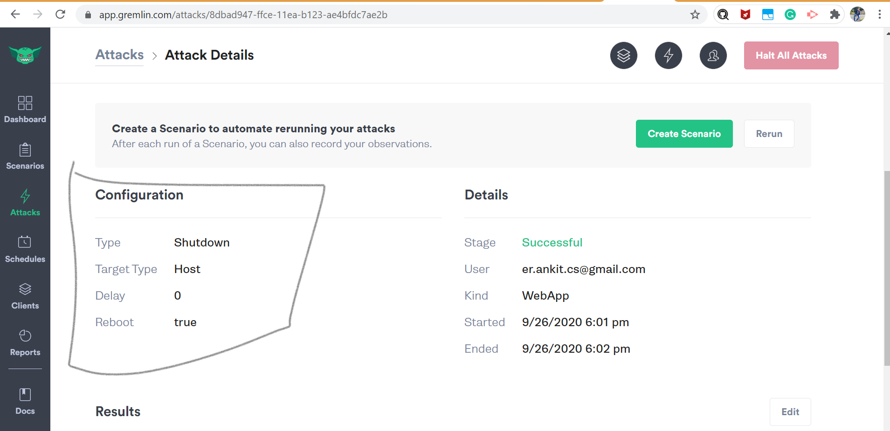

# ChaosEngineeringAWS
This project is intended to learn how we can incorporate chaos engineering within our AWS environment.

### Steps for Setup

1. Create IAM user from AWS Console with Admin permission as we need to provision DynamoDB and Cognito.

2. Setup created IAM User into AWS CLI using aws configure command.

3. Run commands available in file dynamodb-commands.txt  to create DynamoDB Table and load data.

4. Run commands available in file cognito-commands.txt to to create Cognito Identity Pool and IAM Role.

5. Create an EC2 instance from AWS console. Use bootstrap-EC2.txt commands for User Data Script.

6. Update index.html file with Identity Pool Id and Role ARN.

7. Upload index.html and danylo-suprun.jpg into /var/www/html folder

8. Run below command to change ownership of files to ec2-user and use the application with Public IP.
    - cd /var/www/html
    - sudo chown ec2-user:ec2-user *
9. Create Free Tier Account through Gremlin Website.

10. Run commands available into gremlin-commands.txt to install Gremlin agent. You can find TeamID and Secret Key from Team Settings -> Configuration

11. Now you will be able to see your EC2 instance from Gremlin Dashboard.

12. Now You can click on Attack and select Type of attack. First you can check for CPU Consume attack. You can check CPU uses with "top" command in EC2 server and check if you are able to access Facts Application.

13. Let Shutdown server using Gremlin with below configuration. You can verify if application came up properly after attack.

14. Next, we can attack application using black hole to block "aws:dynamodb:us-east-1" provider. You can check application and click on Facts button to check if DynamoDB is working or not.

## Video Demo

